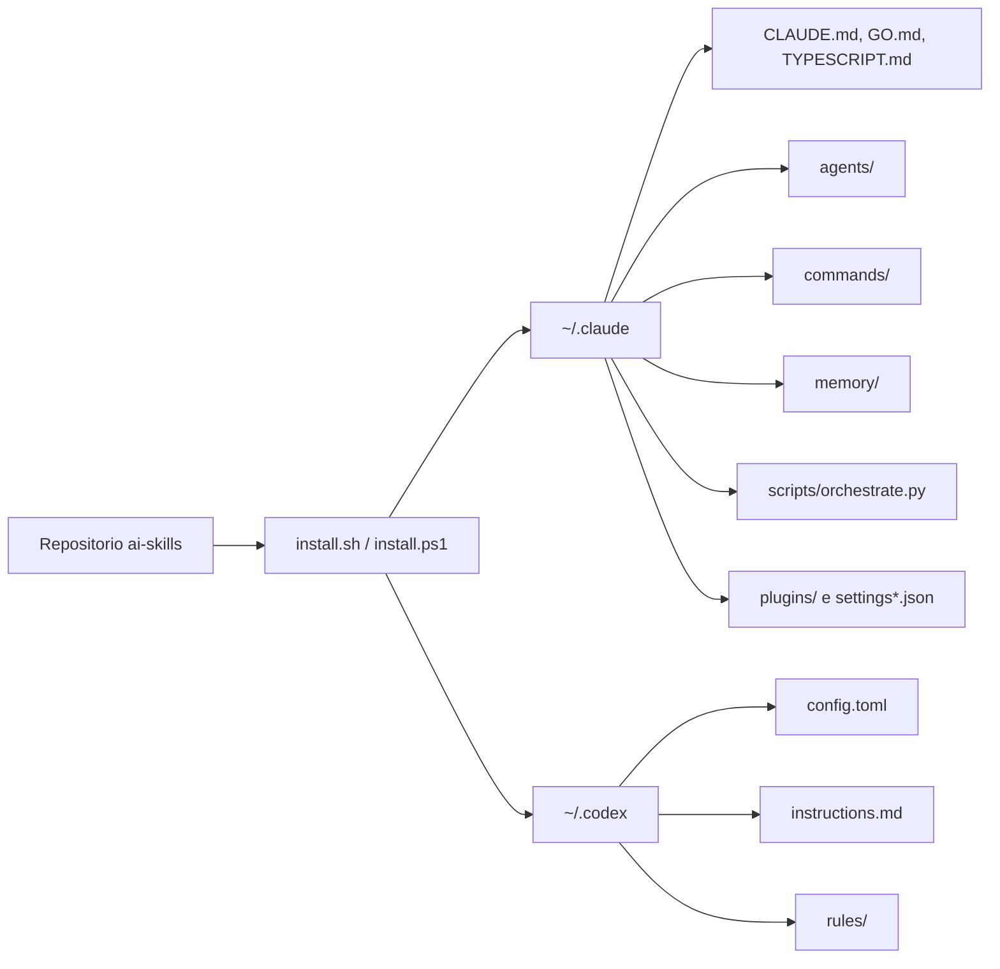
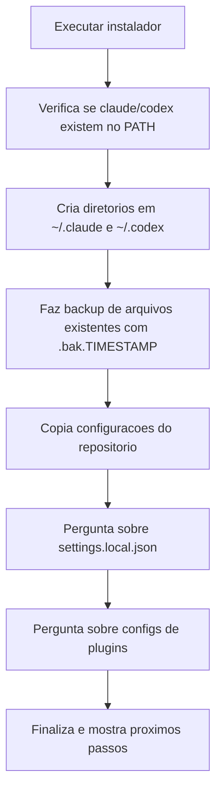

# AI Skills

Colecao de configuracoes, prompts, agentes, regras e scripts para padronizar o uso de `Claude Code` e `Codex` no mesmo ambiente.

O projeto instala um conjunto opinionado de arquivos em `~/.claude` e `~/.codex` para acelerar tarefas de engenharia, revisao, seguranca, orquestracao de agentes e pipelines de desenvolvimento.

## O que este projeto e

Este repositorio funciona como um pacote de bootstrap para CLIs de IA.

- Para `Claude Code`, ele instala:
  - prompts globais
  - agentes especializados
  - comandos prontos
  - memorias operacionais
  - script de orquestracao multiagente
  - configuracoes de plugins e permissoes
- Para `Codex`, ele instala:
  - `config.toml`
  - instrucoes globais
  - regras reutilizaveis

## Visao geral



## Como funciona



## Estrutura do repositorio

```text
.
|-- claude/
|   |-- agents/       # agentes especializados
|   |-- commands/     # comandos prontos, incluindo BMAD e seguranca
|   |-- memory/       # memorias e feedbacks operacionais
|   |-- plugins/      # plugins, blocklist e marketplaces
|   |-- scripts/      # utilitarios como orchestrate.py
|   |-- CLAUDE.md
|   |-- GO.md
|   `-- TYPESCRIPT.md
|-- codex/
|   |-- rules/
|   |-- config.toml
|   `-- instructions.md
|-- install.sh
|-- install.ps1
|-- uninstall.sh
`-- uninstall.ps1
```

## O que sera instalado

### Claude Code

- `CLAUDE.md` com regras globais de comportamento.
- `GO.md` e `TYPESCRIPT.md` com padroes por linguagem.
- Agentes como `orchestrator`, `code-reviewer`, `security-auditor` e `performance-auditor`.
- Comandos para fluxo BMAD, review e seguranca.
- Script `orchestrate.py` para pipelines como `feature`, `review`, `refactor`, `security` e `new-service`.
- `settings.json` e, opcionalmente, `settings.local.json`.
- Configuracoes de plugins, tambem opcionais.

### Codex

- `config.toml` com modelo, effort e permissoes padrao.
- `instructions.md` com regras globais de engenharia.
- Regras em `codex/rules/`, incluindo padroes e checklist de auditoria de seguranca.

## Pre-requisitos

- Ter `Claude Code` e/ou `Codex` instalados na maquina.
- Ter permissao para gravar em `~/.claude` e `~/.codex`.
- Em sistemas Unix, executar scripts com `bash`.
- Em Windows, executar os scripts em PowerShell.

Se os CLIs nao estiverem instalados, o instalador ainda prepara os arquivos, mas voce precisara instalar e autenticar as ferramentas depois.

## Passo a passo de instalacao

### macOS e Linux

1. Entre na pasta do projeto.
2. Execute:

```bash
bash install.sh
```

3. Responda se deseja instalar:
   - `settings.local.json`
   - configuracoes de plugins
4. Ao final, valide:

```bash
claude
codex
```

### Windows

1. Abra PowerShell na pasta do projeto.
2. Execute:

```powershell
./install.ps1
```

3. Responda as perguntas opcionais sobre:
   - `settings.local.json`
   - configuracoes de plugins
4. Ao final, valide:

```powershell
claude
codex
```

## Passo a passo de uso

1. Instale os arquivos com `install.sh` ou `install.ps1`.
2. Abra o `Claude Code` para carregar `~/.claude`.
3. Abra o `Codex` para carregar `~/.codex`.
4. Autentique as ferramentas, se necessario.
5. No `Codex`, ajuste manualmente os projetos confiaveis em `~/.codex/config.toml`.
6. Use o `Claude Code` com os agentes e comandos instalados.
7. Quando precisar de pipeline multiagente, execute o script:

```bash
python3 ~/.claude/scripts/orchestrate.py --pipeline feature --prompt "Sua tarefa"
```

## Exemplos de uso

### Rodar um pipeline de feature

```bash
python3 ~/.claude/scripts/orchestrate.py --pipeline feature --prompt "Adicionar rate limiting na API"
```

### Rodar revisao de codigo

```bash
python3 ~/.claude/scripts/orchestrate.py --pipeline review --path ./src
```

### Rodar auditoria de seguranca

```bash
python3 ~/.claude/scripts/orchestrate.py --pipeline security --path ./src
```

## Backup e seguranca operacional

- Se ja existirem arquivos com o mesmo nome em `~/.claude` ou `~/.codex`, o instalador cria backup com sufixo `.bak.<timestamp>`.
- O projeto nao sincroniza tokens de autenticacao.
- Em uma maquina nova, voce ainda precisa rodar o login das ferramentas, por exemplo `codex auth`.
- `settings.local.json` e opcional porque pode conter permissoes especificas da maquina.

## Desinstalacao

### macOS e Linux

```bash
bash uninstall.sh
```

### Windows

```powershell
./uninstall.ps1
```

Os scripts removem os arquivos instalados, mas nao apagam os backups `.bak.*`.

## Quando usar este projeto

Use este repositorio quando voce quiser:

- padronizar o comportamento do `Claude Code` e do `Codex`
- reaproveitar agentes, comandos e regras em varias maquinas
- reduzir setup manual
- ter um baseline de engenharia, review e seguranca pronto para uso

## Resumo

`ai-skills` e um kit de configuracao para acelerar o setup de assistentes de codigo com regras consistentes, agentes especializados e instalacao reproduzivel em macOS, Linux e Windows.
