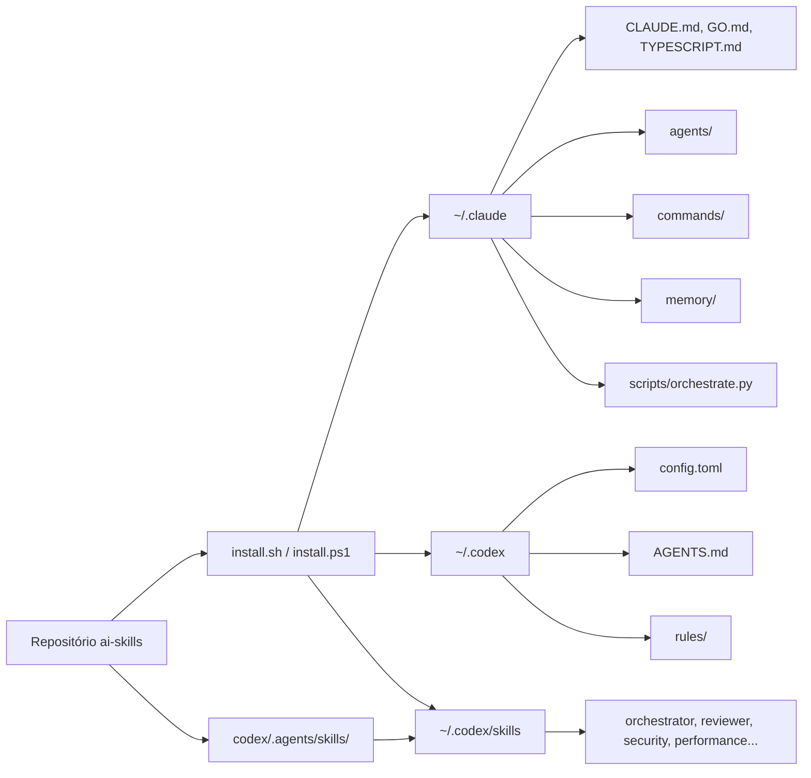
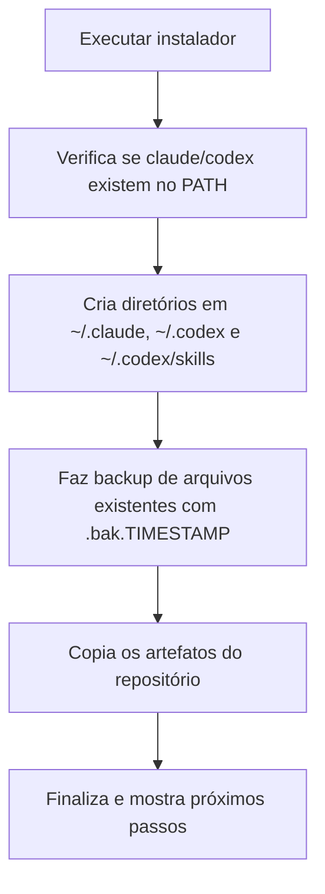

# AI Skills

Coleção de configurações, prompts, agentes, regras e scripts para padronizar o uso de `Claude Code` e `Codex` no mesmo ambiente.

O projeto mantém os arquivos específicos do Codex em `codex/.agents/skills` e instala o resultado em `~/.codex/skills`, enquanto Claude continua em `~/.claude` e a guidance global do Codex em `~/.codex`.

## Fonte oficial do Codex

- Fonte de regras globais do Codex no repositório: `codex/AGENTS.md`
- Destino instalado na máquina: `~/.codex/AGENTS.md`
- Fonte dos skills do Codex no repositório: `codex/.agents/skills/`
- Destino instalado dos skills: `~/.codex/skills`
- Papel do `AGENTS.md` na raiz: regras do repositório (não substitui o global do Codex)

## O que este projeto é

Este repositório funciona como um pacote de bootstrap para CLIs de IA.

- Para `Claude Code`, ele instala:
  - prompts globais
  - agentes especializados
  - comandos prontos
  - memórias operacionais
  - script de orquestração multiagente
- Para `Codex`, ele instala:
  - `AGENTS.md` global
  - `config.toml`
  - skills de usuário
  - regras reutilizáveis

## Visão geral



## Como funciona



## Estrutura do repositório

```text
.
|-- AGENTS.md
|-- claude/
|   |-- agents/       # agentes especializados
|   |-- commands/     # comandos prontos, incluindo BMAD e segurança
|   |-- memory/       # memórias e feedbacks operacionais
|   |-- scripts/      # utilitários como orchestrate.py
|   |-- CLAUDE.md
|   |-- GO.md
|   `-- TYPESCRIPT.md
|-- codex/
|   |-- rules/
|   |-- AGENTS.md
|   |-- config.toml
|   |-- instructions.md
|   `-- .agents/
|       `-- skills/
|           |-- code-reviewer/
|           |-- enterprise-code-architect/
|           |-- orchestrator/
|           |-- performance-auditor/
|           |-- security-auditor/
|           `-- security-fix/
|-- install.sh
|-- install.ps1
|-- uninstall.sh
`-- uninstall.ps1
```

## O que será instalado

### Claude Code

- `CLAUDE.md` com regras globais de comportamento.
- `GO.md` e `TYPESCRIPT.md` com padrões por linguagem.
- Agentes como `orchestrator`, `code-reviewer`, `security-auditor` e `performance-auditor`.
- Comandos para fluxo BMAD, review e segurança.
- Script `orchestrate.py` para pipelines como `feature`, `review`, `refactor`, `security` e `new-service`.

### Codex

- `AGENTS.md` com regras globais persistentes para o Codex.
- `config.toml` com modelo, effort, `service_tier = "fast"` e fallback para `CLAUDE.md`.
- Skills do Codex em `codex/.agents/skills` instaladas em `~/.codex/skills` para arquitetura, orquestração, review, segurança, performance, docs oficiais da OpenAI, screenshot, speech e transcribe.
- Regras em `codex/rules/`, incluindo padrões e checklist de auditoria de segurança.
- Regras globais críticas já incluídas: preservação de arquitetura em projetos legados e proteção de encoding UTF-8 para pt-BR.

## Pré-requisitos

- Ter `Claude Code` e/ou `Codex` instalados na máquina.
- Ter permissão para gravar em `~/.claude`, `~/.codex` e `~/.codex/skills`.
- Em sistemas Unix, executar scripts com `bash`.
- Em Windows, executar os scripts em PowerShell.

Se os CLIs não estiverem instalados, o instalador ainda prepara os arquivos, mas você precisará instalar e autenticar as ferramentas depois.

## Passo a passo de instalação

### macOS e Linux

1. Entre na pasta do projeto.
2. Execute:

```bash
bash install.sh
```

3. Ao final, valide:

```bash
claude
codex
```

### Windows

1. Abra PowerShell na pasta do projeto.
2. Execute:

```powershell
./install.ps1
```

3. Ao final, valide:

```powershell
claude
codex
```

## Checklist rápido pós-instalação

1. Confirmar arquivo global do Codex instalado:

```powershell
Get-Content "$env:USERPROFILE\.codex\AGENTS.md" -TotalCount 20
```

2. Confirmar skills instalados:

```powershell
Get-ChildItem "$env:USERPROFILE\.codex\skills"
```

3. No Codex, pedir para listar instruções ativas e verificar se aparecem as regras de:
- preservação de arquitetura para projetos legados
- UTF-8 obrigatório e preservação de acentuação pt-BR
- roteamento automático para skills instaladas por padrão

4. Confirmar skills principais instaladas:

```powershell
Get-ChildItem "$env:USERPROFILE\.codex\skills" | Select-Object Name
```

Os itens esperados do pacote do repositório incluem:
- `.system/skill-creator`
- `.system/skill-installer`
- `code-reviewer`
- `enterprise-code-architect`
- `openai-docs`
- `orchestrator`
- `performance-auditor`
- `screenshot`
- `security-auditor`
- `security-fix`
- `speech`
- `transcribe`

## Passo a passo de uso

1. Instale os arquivos com `install.sh` ou `install.ps1`.
2. Abra o `Claude Code` para carregar `~/.claude`.
3. Abra o `Codex` para carregar `~/.codex/AGENTS.md`.
4. Verifique se os skills do Codex foram instalados em `~/.codex/skills`.
5. Autentique as ferramentas, se necessário.
6. No `Codex`, ajuste manualmente os projetos confiáveis em `~/.codex/config.toml`.
7. Use o `Claude Code` com os agentes e comandos instalados.
8. Quando precisar de pipeline multiagente, execute o script:

```bash
python3 ~/.claude/scripts/orchestrate.py --pipeline feature --prompt "Sua tarefa"
```

## Exemplos de uso

### Rodar um pipeline de feature

```bash
python3 ~/.claude/scripts/orchestrate.py --pipeline feature --prompt "Adicionar rate limiting na API"
```

### Rodar revisão de código

```bash
python3 ~/.claude/scripts/orchestrate.py --pipeline review --path ./src
```

### Rodar auditoria de segurança

```bash
python3 ~/.claude/scripts/orchestrate.py --pipeline security --path ./src
```

## Backup e segurança operacional

- Se já existirem arquivos com o mesmo nome em `~/.claude` ou `~/.codex`, o instalador cria backup com sufixo `.bak.<timestamp>`.
- Se já existirem arquivos ou skills com o mesmo nome em `~/.codex/skills`, o instalador também cria backup antes de sobrescrever.
- O projeto não sincroniza tokens de autenticação.
- Em uma máquina nova, você ainda precisa rodar o login das ferramentas, por exemplo `codex auth`.

## Desinstalação

### macOS e Linux

```bash
bash uninstall.sh
```

### Windows

```powershell
./uninstall.ps1
```

Os scripts removem os arquivos instalados, mas não apagam os backups `.bak.*`.

## Quando usar este projeto

Use este repositório quando você quiser:

- padronizar o comportamento do `Claude Code` e do `Codex`
- reaproveitar agentes, comandos e regras em várias máquinas
- reduzir setup manual
- ter um baseline de engenharia, review e segurança pronto para uso

## Resumo

`ai-skills` é um kit de configuração para acelerar o setup de assistentes de código com regras consistentes, agentes especializados e instalação reproduzível em macOS, Linux e Windows.
